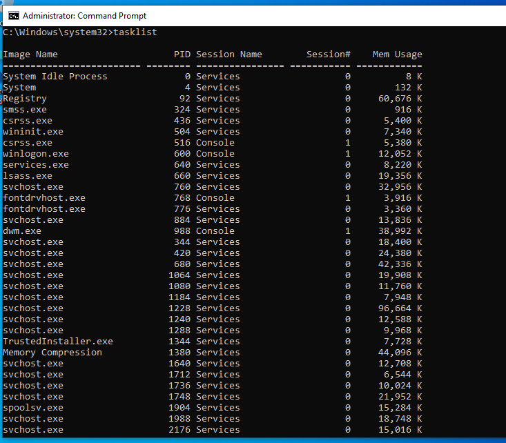
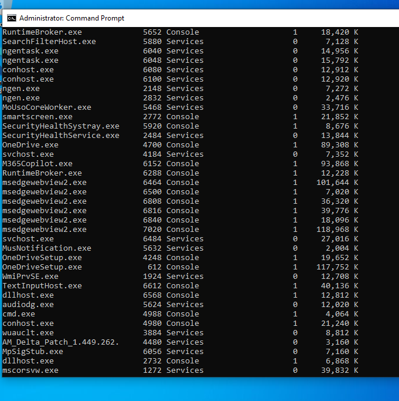
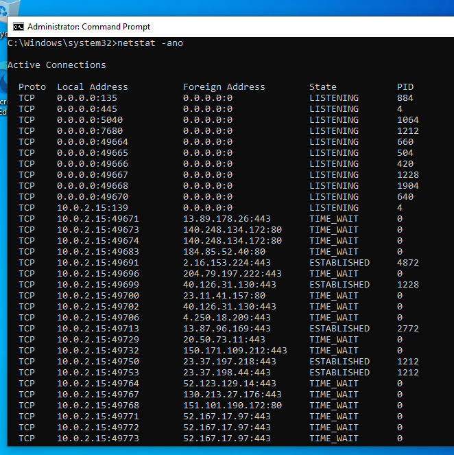
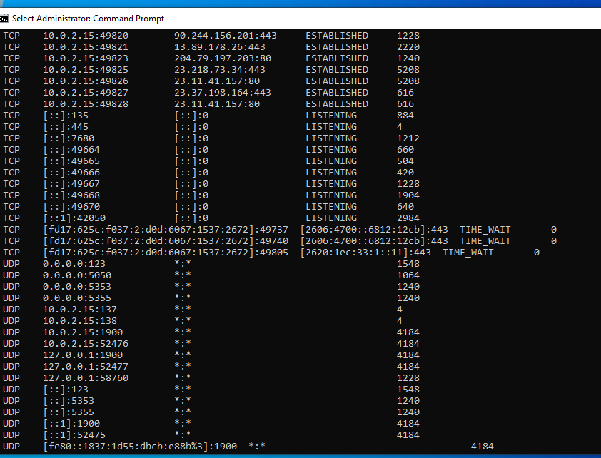
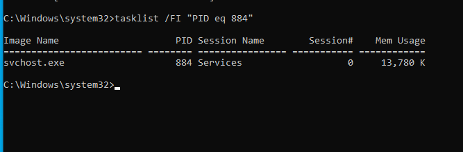
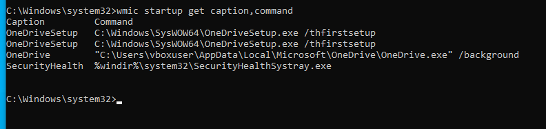
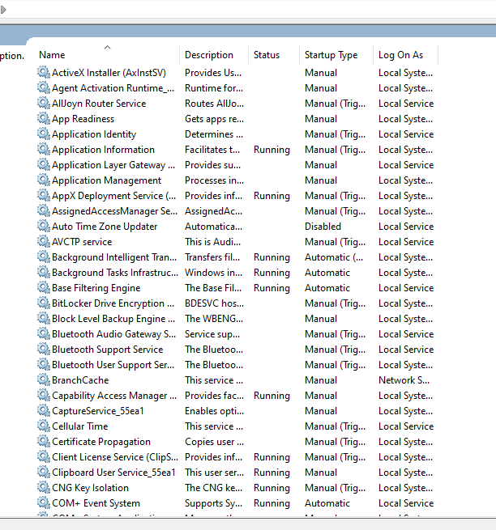
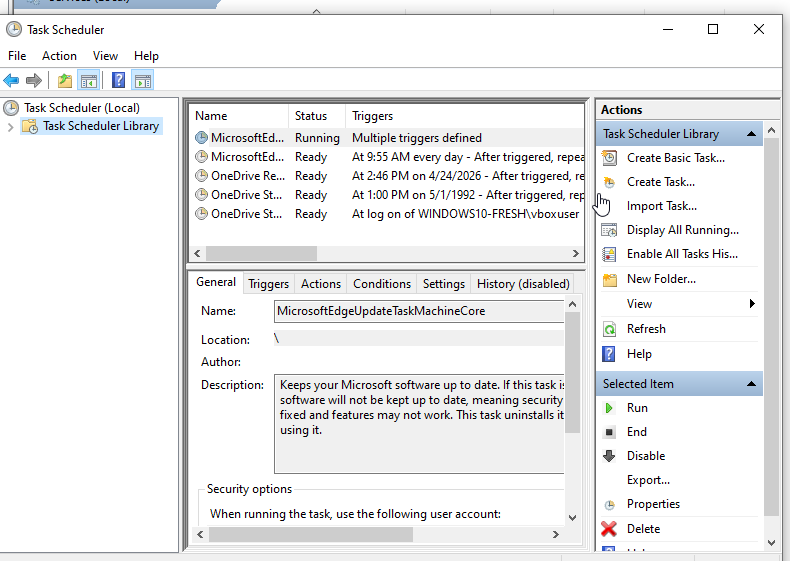
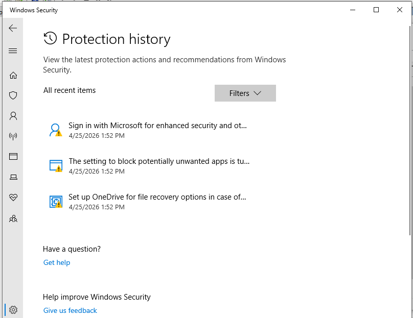

# Windows Endpoint Investigation Lab

## 📌 Overview
This lab demonstrates how to investigate a Windows system for signs of compromise by analysing running processes, network connections, startup programs, services, scheduled tasks, and security alerts.

---

## 🎯 Purpose of the Lab

The goal of this lab is to determine whether a system has been compromised.

In simple terms:

> This investigation checks if anything suspicious is running, connecting to the internet, or set to run automatically without the user’s knowledge.

This simulates the role of a **SOC Analyst** investigating a potentially infected machine.

---

## 🛠️ Lab Setup

- Machine: Windows 10 Virtual Machine  
- Tools Used:
  - Command Prompt (Admin)
  - Task Manager / tasklist
  - netstat
  - WMIC
  - Services (services.msc)
  - Task Scheduler
  - Windows Defender

---

## 🔍 Step 1: Investigate Running Processes

Command used:

```cmd
tasklist
```

### ✅ Findings
- Observed standard Windows processes:
  - `svchost.exe`
  - `explorer.exe`
  - `cmd.exe`
- Multiple `svchost.exe` processes are normal as Windows uses them to run services.

### 🚨 What Would Be Suspicious?
- Unknown processes:
  ```
  malware.exe
  hacktool.exe
  random123.exe
  ```
- Fake system names:
  ```
  svch0st.exe   (0 instead of o)
  explorer1.exe
  ```
- Processes running from unusual locations:
  ```
  C:\Users\Public\
  C:\Temp\
  ```


---

## 🌐 Step 2: Analyse Network Connections

Command used:

```cmd
netstat -ano
```

### ✅ Findings
- Connections to:
  - Port 80 (HTTP)
  - Port 443 (HTTPS)
- States observed:
  - `ESTABLISHED`
  - `TIME_WAIT`

These indicate normal web browsing activity.

### 🚨 What Would Be Suspicious?
- Connections to unknown external IPs:
  ```
  185.x.x.x
  45.x.x.x
  ```
- Unusual ports:
  ```
  4444 (reverse shell)
  1337 (commonly used by attackers)
  ```
- Persistent connections to the same unknown IP



---

## 🔗 Step 3: Map Network Connections to Processes

Command used:

```cmd
tasklist /FI "PID eq 884"
```

### ✅ Findings
- PID mapped to:
  ```
  svchost.exe
  ```

This is a legitimate Windows service.

### 🚨 What Would Be Suspicious?
- If linked to:
  ```
  powershell.exe
  cmd.exe
  unknown.exe
  ```
- Especially if making external connections

---

## ⚙️ Step 4: Check Startup Programs (Persistence)

Command used:

```cmd
wmic startup get caption,command
```

### ✅ Findings
- Legitimate startup programs:
  - OneDrive
  - SecurityHealth

### 🚨 What Would Be Suspicious?
- Unknown startup entries:
  ```
  updater.exe
  backdoor.exe
  runme.exe
  ```
- Suspicious file paths:
  ```
  C:\Users\Public\
  C:\Temp\
  ```

This could indicate malware persistence.

---

## 🛠️ Step 5: Analyse Services

Tool used:
```
services.msc
```

### ✅ Findings
- Standard Windows services observed
- No unusual service names or descriptions

### 🚨 What Would Be Suspicious?
- Unknown services:
  ```
  WindowsUpdateService123
  FakeSystemService
  ```
- Services with:
  - No description
  - Startup type set to **Automatic**

---

## ⏰ Step 6: Check Scheduled Tasks

Tool used:
```
taskschd.msc
```

### ✅ Findings
- Tasks related to:
  - Microsoft Edge updates
  - OneDrive

### 🚨 What Would Be Suspicious?
- Tasks executing:
  ```
  powershell.exe
  cmd.exe
  scripts (.ps1, .bat)
  ```
- Tasks triggered:
  - At login
  - Every few minutes

---

## 🛡️ Step 7: Review Windows Defender

Tool used:
```
Windows Security → Protection History
```

### ✅ Findings
- No malware detections
- Only informational alerts

### 🚨 What Would Be Suspicious?
- Detection of:
  ```
  Trojan
  Backdoor
  Suspicious behaviour
  ```

---

## 📌 Conclusion

The system was analysed for signs of compromise by reviewing processes, network activity, persistence mechanisms, and security alerts.

### ✅ Final Assessment:
- No suspicious processes identified  
- No malicious network connections detected  
- No persistence mechanisms found  
- No unusual services or tasks  
- No malware alerts  

> The system appears clean and operating normally.

---

## 🧠 Key Takeaways

- Endpoint investigation helps detect compromised systems  
- Analysts must distinguish between normal and suspicious behaviour  
- Attackers often use:
  - hidden processes  
  - persistent startup programs  
  - suspicious network connections  
